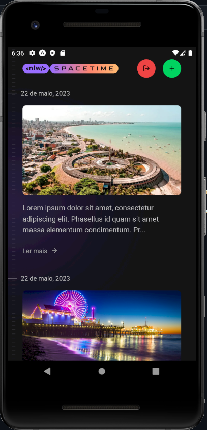

# Spacetime Mobile <br>
[](https://github.com/JaasielAntunes/nlw-spacetime-mobile/blob/master/LICENSE)
<br> <br>

# Sobre o projeto:
Parte Mobile da aplicação Spacetime que foi desenvolvida durante o NLW 12 (trilha ignite) promovido pela [Rocketseat](https://rocketseat.com.br "Site da Rocketseat").
<br> <br>

A aplicação tem como objetivo guardar recordações de eventos importantes que acontecerão na vida do usuário onde o mesmo realiza login com autenticação via Github
sendo necessário ter uma conta na plataforma para poder realizar o login no Spacetime. A aplicação é multiplataforma, ou seja, Web e Mobile.
<br> <br>

## :hammer_and_wrench: Tecnologias utilizadas:
* Mobile
  * React Native 
  * Expo
  * NativeWind
  * ESLint
  * Prettier Tailwind
<br> <br>

## :car: Iniciando a aplicação:
Baixe o repositório com git clone e entre na pasta do projeto.
```bash
$ git clone https://github.com/JaasielAntunes/nlw-spacetime-mobile
```
* Mobile
  * Necessário ter o Android Studio e um emulador instalado
  * Descomente o parâmetro host localizado no arquivo server.ts no backend, crie um novo OAuth app no Github OAuth para ser gerado
  o GITHUB_CLIENT_ID
  * Copie e cole nos parâmetros revocationEndpoint e clientId localizados no arquivo index.tsx na pasta app
```bash
$ cd ..
$ cd mobile
$ npm install
$ npm run start
```
<br>

## :camera_flash: Screenshots:
<div>
    
    
</div>

<br>

<div>
    
</div>

## :email: Contato:
contato.jaasiel@gmail.com
<br> <br>

## Autor:
Jaasiel Antunes de Araujo
